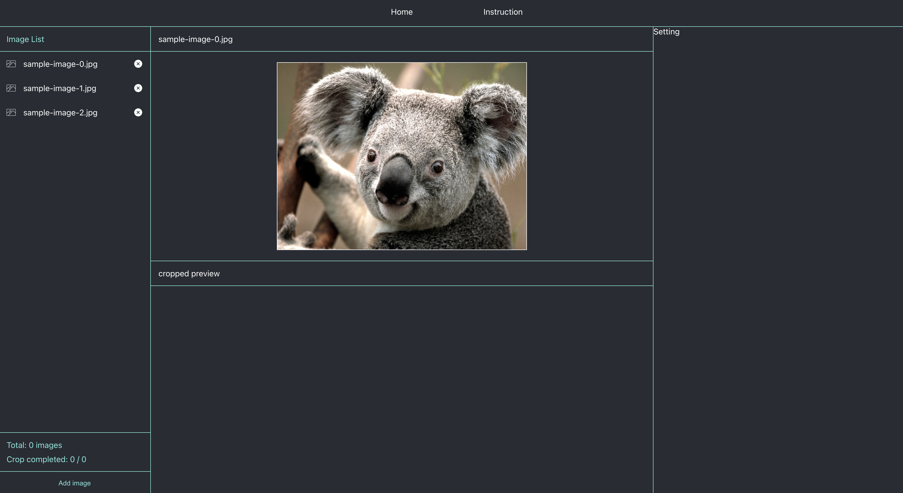

# Multiple Image Cropping Tool

Current state

### ongoing

crop image

### done

set canvas size on img src change

### todo

##### cropper

- draw rectangle on canvas
- save rectangle coordinates
- make cropped image with rect coordinates
- save cropped to redux
- show cropped on preview section

##### image list

- image list add / remove
- change delete icon
- ellipsis image name
- crop completed state
- list scroll y on overflow

##### setting

- save current image
- save all cropped images
- name prefix

##### instruction
